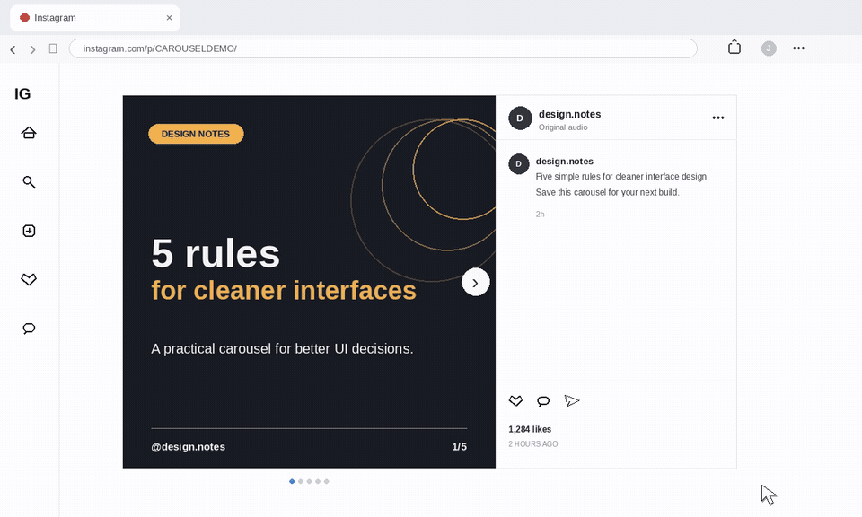

# Insta2PDF

> Save any public Instagram carousel as a PDF. In the browser. No server. No Python. No nonsense.



---

## What it does

You open an Instagram carousel post. You click the extension. You get a PDF.

That's it.

Insta2PDF rewinds the carousel to slide 1 automatically — so deep-linked URLs like `?img_index=16` never give you a partial export — steps through every slide, pulls the full-resolution images, and hands you a PDF through the browser's Save As dialog. The whole thing takes a few seconds and leaves nothing running in the background.

**Doesn't work on:** video reels, Stories, or private accounts. Publicly visible image carousels only.

---

## Demo

The GIF above shows the full flow — open a carousel, click Convert, get a PDF.

---

## Install

No build step. No Node. No Python. Just load it.

1. Clone or download this repo so the `extension` folder is on your disk.

2. Open your browser's extensions page:
   ```
   chrome://extensions/
   ```
   ```
   edge://extensions/
   ```

3. Enable **Developer mode** (top-right toggle).

4. Click **Load unpacked** → select the `extension` folder.

5. Pin it to your toolbar so it's always one click away.

> If you have an older version installed, remove it first — two versions loaded at the same time will conflict.

---

## Usage

1. Open any public Instagram carousel post (multiple images).
2. Click the **Insta2PDF** icon in your toolbar.
3. Hit **Convert current post to PDF**.

You'll see the status update as it works:
```
Found 8 slide(s). Creating PDF…
Done — 8 slides saved.
```

The file saves as the post's shortcode (e.g. `C1aBcDeFgHi.pdf`).

---

## Requirements

| | |
|---|---|
| Browser | Chrome or Edge (any current release) |
| Developer Mode | Must be enabled in the extensions page |

---

## Troubleshooting

| Symptom | Likely cause | Fix |
|---|---|---|
| "Open the Instagram carousel first." | Active tab isn't on instagram.com | Navigate to the post, then click the extension |
| "No slides found." | Page not fully loaded or layout changed | Scroll the post into view, wait, then retry |
| "Could not download slide N (403)." | CDN URL expired between collection and download | Click Convert again immediately after opening the post |
| PDF starts mid-carousel | Deep link + rewind didn't complete in time | Reload the page and retry |

---

## Contributing

All contributions are welcome — bug fixes, new features, better docs, or just ideas. If you spot something broken or have something to add, open an issue or send a PR. No gatekeeping here.

```
# Fork → branch → change → push → PR
git checkout -b feature/your-idea
git commit -m "Add your idea"
git push origin feature/your-idea
```

Only ask: keep it working in Manifest V3, test in Chrome or Edge before submitting.

---

## License

MIT — see [LICENSE](LICENSE).

---

<p align="center">Built by <a href="https://github.com/jeelsoni01">Jeel Nandha</a></p>
